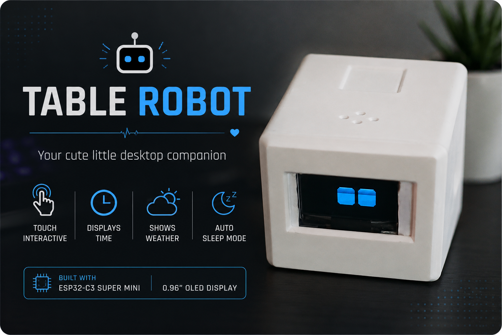

# 🤖 Table Robot

<p align="center">
  
</p>

<p align="center">
An expressive desktop companion built using an <b>ESP32-C3 Super Mini</b> and a <b>0.96" OLED Display</b>.
</p>

<p align="center">
  
  
  
  
</p>

---

# 📖 Overview

Table Robot is a small interactive desktop companion that brings personality to your workspace.

Instead of simply displaying information, it behaves like a tiny pet by reacting to touch with different emotions, sleeping when left alone, expressing affection through animations, and displaying live weather and time when requested.

The project is built around the **ESP32-C3 Super Mini**, a **0.96" SSD1306 OLED display**, and a **capacitive touch sensor**, making it inexpensive, compact, and easy to build.

---

# ✨ Features

- 😴 Sleep mode
- 😊 Idle face
- 🤔 Curious face
- 😪 Tired face
- 😠 Angry face
- ❤️ Love animation
- 🌤 Live Weather Information
- 🕒 Live Clock using NTP
- 📶 WiFi Connection Status
- 💖 Smooth OLED Animations
- 👆 Touch Gesture Recognition
- ⚡ Lightweight ESP32-C3 implementation

---

# 🎮 Touch Controls

| Gesture | Action |
|---------|--------|
| 1 Tap | Wake → Idle Face |
| 2 Taps | Curious Face |
| 3 Taps | Tired Face |
| 4+ Taps | Angry Face |
| Hold for 4 Seconds | Love Animation ❤️ |
| Hold for 6 Seconds | Weather & Time Screen 🌤 |
| Release Touch | Return to Idle |
| No Interaction for 10 Seconds | Sleep Mode 😴 |

---

# 🛠 Hardware Required

| Component | Quantity |
|------------|---------:|
| ESP32-C3 Super Mini | 1 |
| SSD1306 OLED Display (128×64) | 1 |
| TTP223 Capacitive Touch Sensor | 1 |
| USB Type-C Cable | 1 |
| Jumper Wires | As Required |

---

# 🔌 Wiring

## OLED Display

| OLED Pin | ESP32-C3 |
|-----------|-----------|
| VCC | 3.3V |
| GND | GND |
| SDA | GPIO 8 |
| SCL | GPIO 9 |

---

## Touch Sensor

| Sensor Pin | ESP32-C3 |
|------------|-----------|
| VCC | 3.3V |
| GND | GND |
| OUT | GPIO 4 |

---

# 📁 Project Structure

```
Table-Robot/
│
├── TableRobot.ino
│
├── LoveEyes.h
├── LoveEyes.cpp
│
├── WeatherClock.h
├── WeatherClock.cpp
│
├── Idle.h
├── Sleep.h
│
├── images/
│   ├── robot.jpg
│   ├── wiring.png
│   └── demo.gif
│
├── README.md
└── LICENSE
```

---

# 📚 Libraries Used

Install the following libraries from the Arduino Library Manager.

- Adafruit GFX
- Adafruit SSD1306
- FluxGarage RoboEyes
- ArduinoJson
- WiFi
- HTTPClient

---

# 🌦 Weather API Setup

The project uses the **OpenWeatherMap API** to fetch live weather data.

Create a free account:

https://openweathermap.org/api

Generate an API Key and replace:

```cpp
String apiKey = "YOUR_API_KEY";
```

inside

```
WeatherClock.h
```

---

# 📍 Changing the Weather Location

Simply edit the following lines inside **WeatherClock.h**

```cpp
String city = "Nagpur";
String country = "IN";
```

Example:

```cpp
String city = "Bengaluru";
String country = "IN";
```

Another example:

```cpp
String city = "Mumbai";
String country = "IN";
```

Or

```cpp
String city = "Srinagar";
String country = "IN";
```

---

# 🕒 Time Synchronization

The clock uses the ESP32's built-in NTP support.

```cpp
configTime(19800, 0, "pool.ntp.org");
```

Current timezone:

- GMT +5:30 (India)

You can change this for your country.

---

# 🚀 Getting Started

## 1. Clone Repository

```bash
git clone https://github.com/yourusername/Table-Robot.git
```

---

## 2. Open Arduino IDE

Open

```
TableRobot.ino
```

---

## 3. Install Libraries

Install all required libraries.

---

## 4. Configure WiFi

Open

```
WeatherClock.h
```

Update

```cpp
const char* ssid = "YOUR_WIFI_NAME";
const char* password = "YOUR_WIFI_PASSWORD";
```

---

## 5. Configure Weather

Replace

```cpp
String apiKey = "YOUR_API_KEY";
```

---

## 6. Upload

Select

```
ESP32-C3 Super Mini
```

Upload the sketch.

---

# 🎥 Demo

## Idle

<p align="center">

</p>

---

## Love

<p align="center">

</p>

---

## Weather

<p align="center">

</p>

---

# 💡 Future Improvements

- 🎤 Voice Assistant
- 🔋 Battery Monitoring
- 📅 Calendar
- 🌧 Animated Weather Icons
- ☁ OTA Firmware Updates
- 📱 Mobile App
- 📶 Bluetooth Configuration
- 😊 More Facial Expressions
- 🔊 Sound Effects
- 🤖 Servo Head Movement
- 🎵 Bluetooth Speaker Mode
- 💬 ChatGPT Integration
- 📸 Camera Support
- 😄 Emotion Recognition

---

# 🤝 Contributing

Contributions are welcome!

Feel free to:

- Open an Issue
- Submit a Pull Request
- Suggest Improvements
- Report Bugs

---

# 📄 License

This project is licensed under the MIT License.

See the **LICENSE** file for details.

---

# ⭐ Support

If you found this project useful,

please consider giving it a ⭐ on GitHub.

It helps others discover the project and motivates future development.

---

<p align="center">

Made with ❤️ using ESP32-C3

</p>